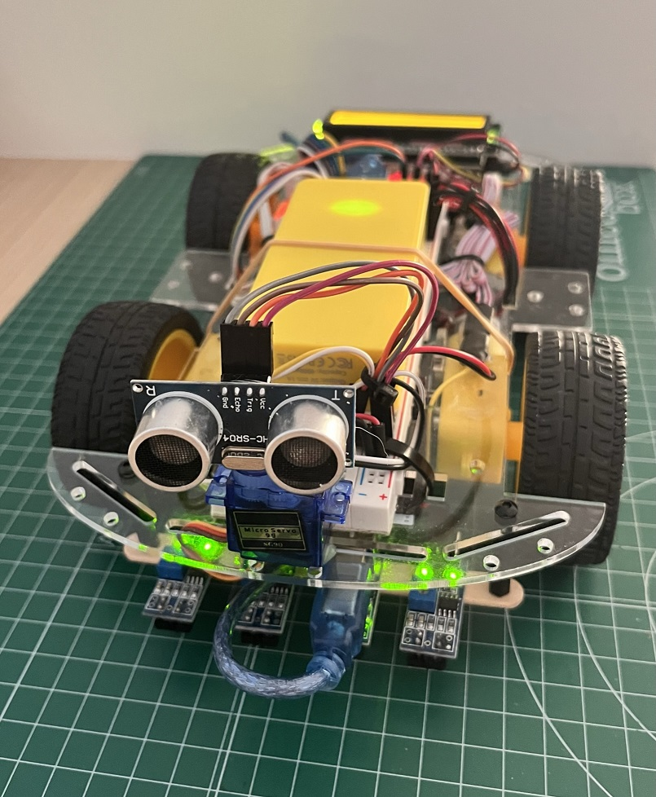

# Smart4car_test

Autor: Jordi Rodríguez  
  
Práctica de programación ordenada en Arduino utilizando pestañas   
Crearemos un vehículo de 4 ruedas con el material especificado  
Para la programación usaremos la plataforma Arduino IDE:  

https://www.arduino.cc/en/software  

Se han incluido las siguientes librerías:  

- NewPing  
https://bitbucket.org/teckel12/arduino-new-ping/src/master/  

- LiquidCrystal I2C  
https://github.com/fdebrabander/Arduino-LiquidCrystal-I2C-library  

- Servo (incluida en Arduino IDE)  
https://github.com/arduino-libraries/Servo

Este código realiza las siguientes funciones simples:  
- Medición de ángulo de giro del servo  
- Medición de 1 sensores de distancia  
- Lectura de 4 sensores de línea  
- Lectura de 2 encoders en motores traseros  
- Prueba de motores  
  
  
  

## Material utilizado

- 1 x HC-SR04 = Sensor ultrasonido de distancia  
- 1 x SG90 = MicroServo 9g  
- 4 x TCRT5000 = Sensor infrarrojo de proximidad
- LCD I2C = Pantalla lcd
- L298N = Controlador de motores
- 4 x Motores Arduino
- 2 x Encoders motores Arduino (alimentados a 3'3v)  
- Protoboard
  

## Pines de conexion

A0 = Servo frontal
A1 = Sensor ultrasonido-Echo (HC-SR04)  
A2 = Sensor ultrasonido-Trigger (HC-SR04)  
A3 =   
A4 = I2C LCD (SDA)  
A5 = I2C LCD (SCL)  
D0 = (RX)  
D1 = (TX)  
D2 = (INT0) Encoder izquierdo  
D3-= (INT1) Encoder derecho  
D4 = Sensor línea izquierda extremo     
D5-= ENB motor izquierdo  
D6-= ENA motor derecho  
D7 = IN1 motor derecho  
D8 = IN2 motor derecho  
D9-= IN3 motor izquierdo  
D10-= IN4 motor izquierdo  
D11-= Sensor línea izquierda  
D12 = Sensor línea derecha   
D13 = Sensor línea derecha extremo  
